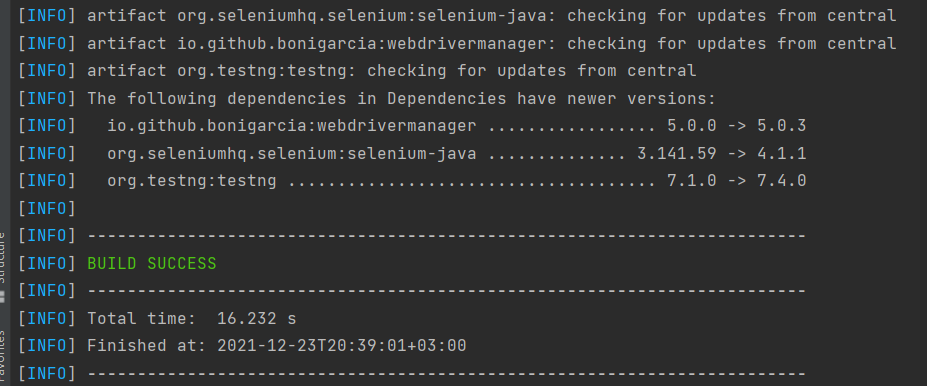
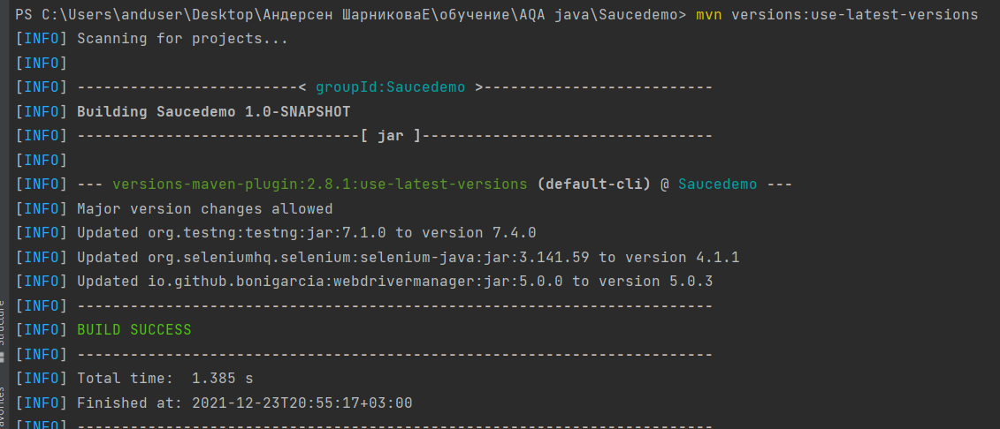
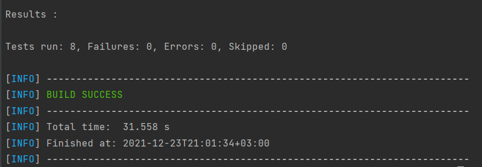
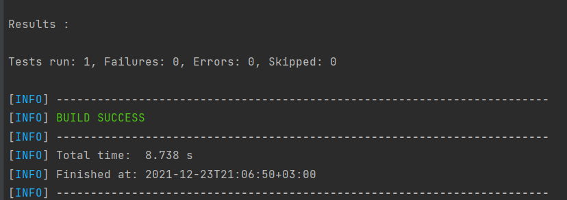

###### **Чек-лист тестирования www.saucedemo.com**

**Login Page - https://www.saucedemo.com/**

1.Введение валидных данных в поля Username и Password 

2.Введение невалидных данных в Username и Password 

3.Проверка регистрации с пустым полем Username 

4.Проверка регистрации с пустым полем Password 

5.Проверка регистрации с пустыми полями Username и Password 

6.Проверка наличия всех сообщений об ошибке.

**Inventory Page - https://www.saucedemo.com/inventory.html**

7.Проверка на нахождении на странице Inventory 

8.Проверка элемента Меню (кликабельность и содержание) 

9.Проверка элемента Сортировки (кликабельность, содержание, оценка правильности сортировки по разным параметрам) 

10.Добавление товара в корзину Cart

**Cart Page - https://www.saucedemo.com/cart.html** 

11.Проверка перехода в Cart со страницы Inventory Page и сравнение соответствия товара в корзине тому, который добавляли со страницы Inventory 

12.Проверка удаления товара из корзины 

13.Проверка возможности из корзины вернуться на страницу Inventory, чтобы продолжить покупки 

14.Проверка перехода на страницу Checkout со страницы Cart

**Checkout Page https://www.saucedemo.com/checkout-step-one.html**

15.Заполнение формы Your Information валидными данными 

16.Заполнение формы Your Information: все поля пустые 

17.Заполнение формы Your Information: поле First name пустое, остальные валидны 

18.Заполнение формы Your Information: поле Last name пустое, остальные валидны 

19.Заполнение формы Your Information: поле Zip пустое, остальные валидны 

20.Заполнение формы Your Information: внесение невалидных данных в поле First name(цифры) 

21.Заполнение формы Your Information: внесение невалидных данных в поле Zip (буквы) 

22.Проверка перехода на страницу Checkout: Overview после нажатия на кнопку Continue на старнице Checkout Page.

https://www.saucedemo.com/checkout-step-two.html

###### **Работа с обновлениями версий библиотек, использующихся на проекте**

**Команда для просмотра доступных обновлений библиотек используется команда**

_mvn versions:display-dependency-updates_ 

Результат:

**Команда для автоматического обновления всех версий**

_mvn versions:use-latest-versions_
 
Результат:

###### **Запуск тестов через Terminal**

**Команда для запуск всех тестов в классе**

_mvn -Dtest=LoginPageTest test_

Результат:

**Команда для запуска определенного теста в классе**

_mvn clean -Dtest=ProductsCriticalPathTest#addToCart test_

Результат:

**Команда для запуска нескольких тестов в классе**

_mvn clean -Dtest=ProductsCriticalPathTest#addToCart+checkTheNameItemInTheCart test_

**Команда для запуска Test Suite**

_mvn clean test -DsuiteXmlFile=src/test/resources/regression.xml_

